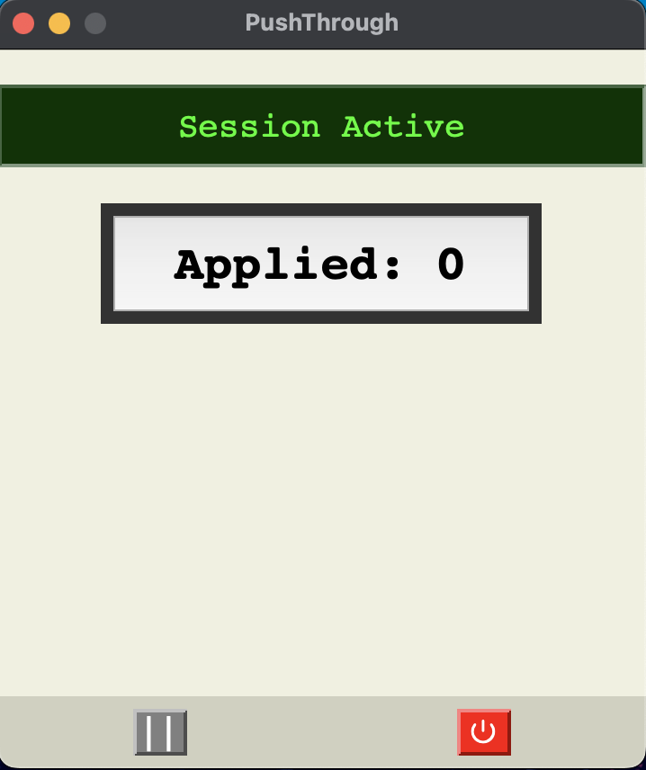
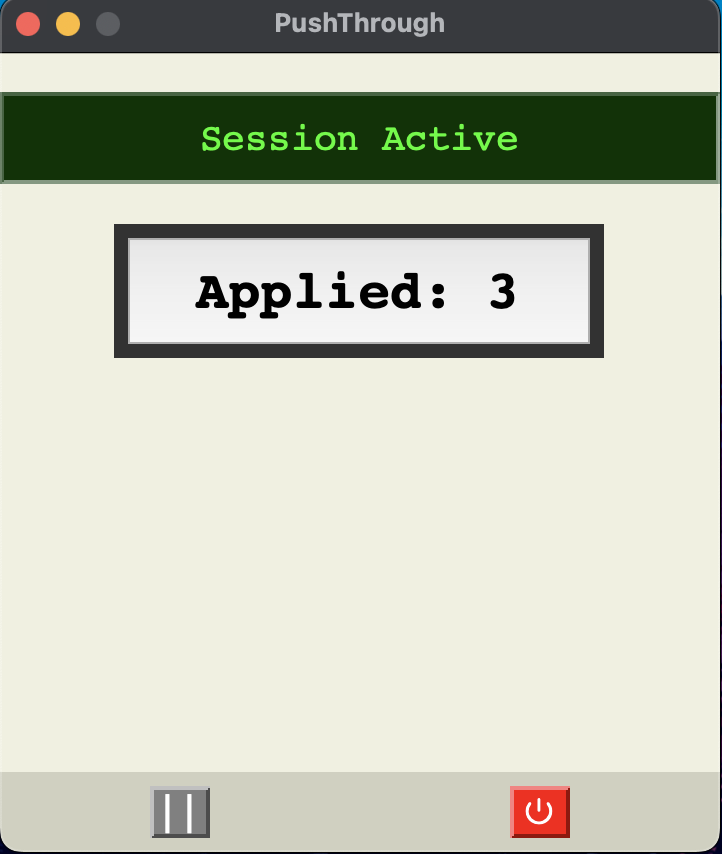

# PushThrough

PushThrough is a minimal, ADHD-friendly desktop button that logs job applications (or any repeated action) one click at a time.

## Why PushThrough

PushThrough adds a tactile, visual layer to tracking repetitive tasks. It’s built for focus, flow, and minimal mental load. No tabs, no mental math, just click and move on.

---

## Features

- Single-click counter with satisfying feedback
- Resume sessions anytime
- Pause or fully end and log a session
- Logs start/end time and click count to CSV
- Stores data in `~/Library/Application Support/PushThrough/` (macOS-safe)

---

## Screenshots




---

## How to Run

```
bash
python3 main.py
```

If you're using a virtual environment:

```
source venv/bin/activate
python3 main.py
```

## Controls

- Main button: Log an action
- Pause button (||): Save and exit without ending session
- Power button (⏻): End session and write to permanent log

## Future Improvements

- Daily and weekly summaries
- Multiple task modes (e.g., "Applied", "Reached Out", "Focused")
- Visual stats dashboard (daily history, streaks, heatmaps)
- Export as Markdown or JSON
- Cross-platform support (Windows, Linux)
- Optional Streamlit or local web version

Built for frictionless self-accountability. Simple, tactile, and yours to customize.

---

Let me know if you're ready to commit this or want help setting up the repo's public-facing polish (like description, tags, or repo topics).